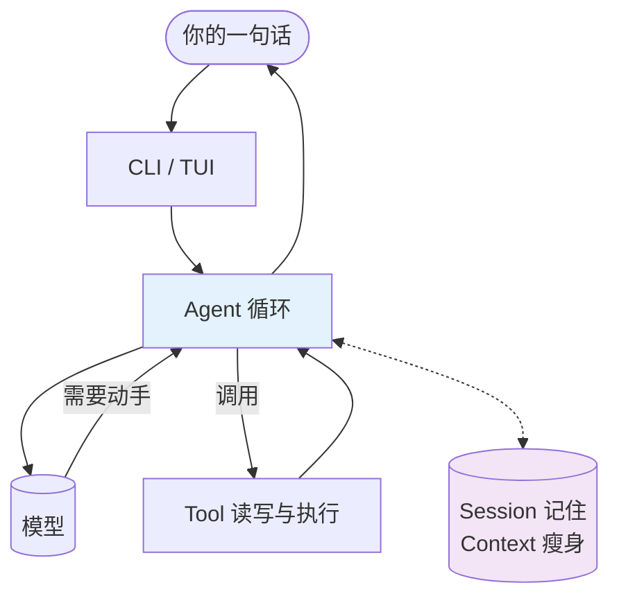

# 00 阅读指南 — 先看清全貌，再进去

这份教程只回答一个问题：**一句人话如何变成一连串对代码库的操作，再回到一句人话？**

能回答它，其他细节可按需再查。

## 一张图



- `CLI/TUI` 只管收话与展示
- `Agent` 在“问模型”与“调工具”间循环
- `Tool` 是手脚，`Provider` 藏在 `Model` 格里做翻译
- `Memory` 让循环能持续多轮且不撑爆
- `Permission` 与 `UI` 是两道边界，图中未单画，后面各用一章

后面每一章都在讲这张图的一个格子。章首会标“我们在地图的 XX 格”。

## 怎么读

- 第一次：按顺序 01→11。章首的“这一章解决什么问题”是路标。
- 只想看核心：03（旅程）→04（Agent）→05（Tool）→08（Context），回头再补。
- 每章结构：真实场景建直觉 → 概念 → 在项目里的位置 → 最小核心代码 → 为什么这样写。
- 路径形如 `src/minicode/agent/core.py` 均可 `read/grep` 验证，不需背。

## 需要什么

`Python >=3.10` 与一个模型 API Key。无需 Node.js。所有落盘收于单根（`platformdirs` 默认或 `MINICODE_DATA_DIR`），便于隔离。

## 验证

```bash
ls docs/tutorial
grep -rn "src/minicode" docs/tutorial | wc -l
```

> 进阶：`advanced/ADV-01-04` 是按需深潜（缓存感知、调度台、重试与存储），不影响主线。
