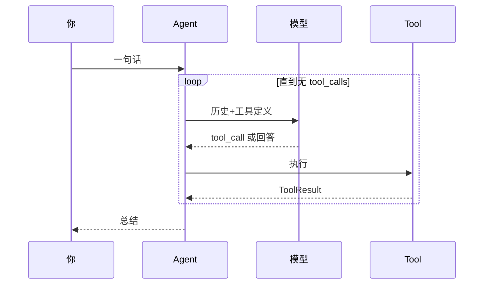

# 03 一次完整的执行是如何流动的

**一句话按回车后，内部经历了什么？**

> 定位：我们在全局图的完整旅程，把 `00` 的图从“看懂”推到“能讲出来”。

## 走一遍

你输入：`修好 utils.py 的 parse_date 空串崩溃，改完跑 pytest`。

1. `CLI` 收话，取出当前 `Session` 交 `Agent`。
2. `Agent` 的 `query` 先 `_prepare_context` 整理历史，再带 `system`（含 `{{ project }}` 与 `{{ project_instructions }}`）、历史、`tools` 定义去问 `Provider`。
3. 模型回 `read({"file_path":"utils.py"})`，`Agent` 经 `ToolEnvironment` → `ToolRegistry` 执行，包为 `role: tool` 加回历史。
4. 再问 → `edit` → 执行 → 加回 → 再问 → `bash({"command":"python -m pytest"})` → 执行 → 加回。
5. 某轮模型只回文字，`Agent` 以 `Submitted` 结束，经 `Session` 落盘与 `EventSink` 通知界面。

## 为何不是一次调完

一是窗口有限，整仓喂不下，`max_tokens` 很快耗尽；二是需要反馈，改后是否通过 `pytest` 只有跑过才知道。如果一次把所有文件喂给模型，它只能猜，猜错也无法纠正。循环把“执行—观察”还给模型，让错误成为下一轮的历史，模型有机会自愈。

如果去掉循环会怎样？`Agent` 会退化为单次问答的封装，`Tool` 永不被调用，`Session` 与 `Context` 也失去意义，整个项目只剩下 `Provider` 的透传。

## 记住什么

循环即 `问模型—调工具—加回历史—再问`，直到模型不再提需求。其余模块（记忆、瘦身、权限、界面）只为让它在真实仓库里更可靠、更持久。
